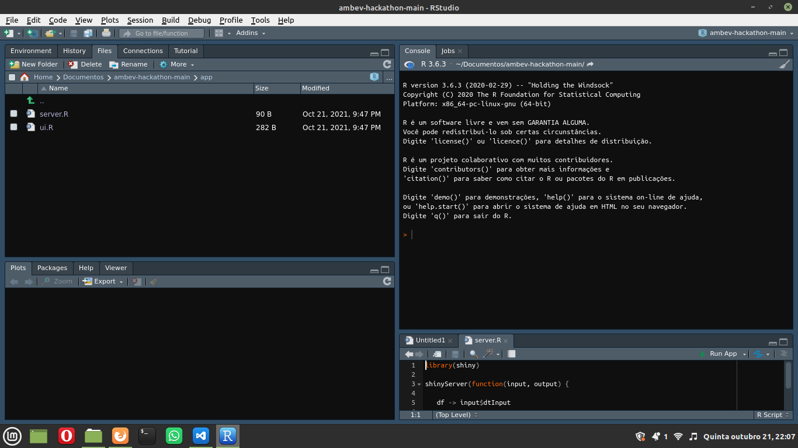

# Processo de instalação do ambiente
1. passo: Confirme que o [Rstudio](https://www.rstudio.com/products/rstudio/download/) esteja baixado na sua máquina, caso contrario clique no nome "Rstudio" e baixa a versão referente ao seu sistema operacional

2. passo: Abrir a aplicação do Rstudio e copiar o projeto paraa a sua maquina, essa prática deve ser feita diretamente pelo Rstudio juntamente ao GitHub, para isso é necessario ter o [Git](https://git-scm.com/downloads) em seu computador, caso não tenha clique no nome 'Git' e baixe o arquivo referente a sua maquina.

3. passo: Após abrir o Rstudio, o usuario deve selecionar, no canto supeior esquerdo o nome `File` -> `New Project...` -> `Version control` -> `Git`.

4. passo: Efetuado o passo anterior uma tela `Clone Git Repository` será aberta no próprio Rstudio, a seguir é precisso que o usuario copie e cole o `URL - https://github.com/erikyryan/ambev-hackathon` do projeto do GitHub, e assim o nome do diretório será escrito automaticamente, após ttudo  clique em `Create project`.

5. passo: Para a conclusão do processo o usuário deve digitar o nome de usuário do seu GitHub e sua senha e pronto.

6. passo: Caso o quinto passo falhe, confira no seu GitHub se sua autorização de acesso é atraves de senha ou do [token](https://docs.github.com/pt/authentication/keeping-your-account-and-data-secure/creating-a-personal-access-token)

## Passo a Passo - por imagens
 Passo 1

 Passo 2 

 Passo 3 

 Passo 4 

 Passo 5 

 Passo 6 

 Passo 7 

# Processo de execução
1. passo: Abra o R e clone o repositório por meio do Git.

2. passo: Clique na pasta `app`

3. passo: Abra o arquivo `app.r`  

4. passo: No canto superior direito na mesma aba do arquivo clique em `Run App` e sua aplicação estará rodando 

5. passo: Após a abertura da aplicação o usuário deve entrar com a planilha de dados referente aos seus pedidos

6. passo: Clique no botão `Browse` e navegue ate a pasta resources: `ambev-hackathon -> resources` 

7. passo: Os arquivos HW deveram ser usados para o metodo Holt Winter, e o PR utilizado para a Recomendação, ou metodo Apriore.

8. passo: Clique no arquivo referente ao metodo que você estar testando e espere para o resultado ser gerado   

## Passo a Passo - por imagens

 Passo 1

 Passo 2

 Passo 3
